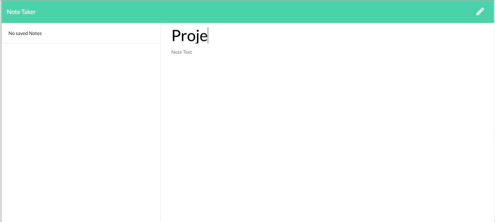
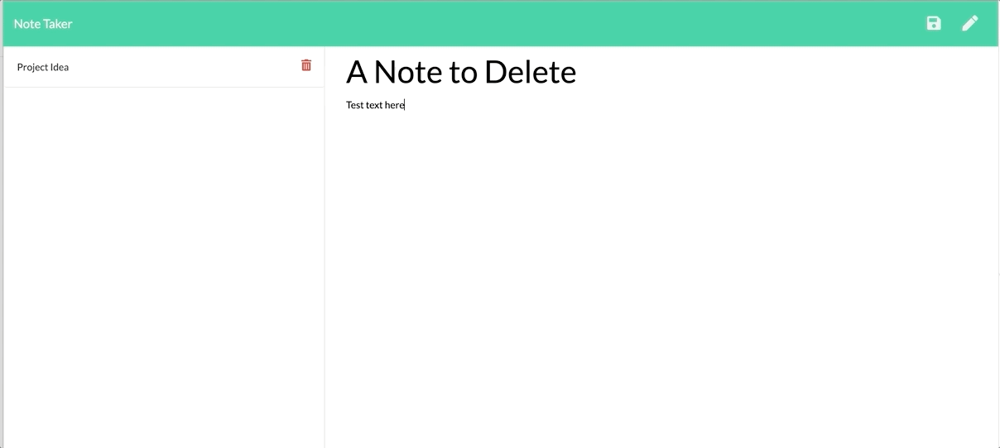

# Challenge 11 | Note Taker | QS

  ## Description

  [](https://opensource.org/licenses/ISC)

  A simple express.js server designed to allow users to create, store and delete notes as needed. The application leverages Node.js, Express, path, fs, and nanoid.

  
  The application is deployed live [here](https://desolate-peak-22221.herokuapp.com/notes).

  ## Table of Contents

  * [Visuals](#visuals)
  * [User Story and Acceptance Criteria](#user-story-and-acceptance-criteria)
  * [Installation](#installation)
  * [Usage](#usage)
  * [Contributions](#contributions)
  * [Tests](#tests)
  * [Questions](#questions)

  ## Visuals
  

  

  ## User Story and Acceptance Criteria

  ### User Story
  ```
  AS A small business owner
  I WANT to be able to write and save notes
  SO THAT I can organize my thoughts and keep track of tasks I need to complete
  ```

  ### Acceptance Criteria
  ```
  WHEN I open the Note Taker
  THEN I am presented with a landing page with a link to a notes page
  ```
  ```
  WHEN I click on the link to the notes page
  THEN I am presented with a page with existing notes listed in the left-hand column, plus empty fields to enter a new note title and the note’s text in the right-hand column
  ```
  ```
  WHEN I enter a new note title and the note’s text
  THEN a Save icon appears in the navigation at the top of the page
  ```
  ```
  WHEN I click on the Save icon
  THEN the new note I have entered is saved and appears in the left-hand column with the other existing notes
  ```
  ```
  WHEN I click on an existing note in the list in the left-hand column
  THEN that note appears in the right-hand column
  ```
  ```
  WHEN I click on the Write icon in the navigation at the top of the page
  THEN I am presented with empty fields to enter a new note title and the note’s text in the right-hand column
  ```
  
  ## Installation

  This application runs on Node.js and uses a number of modules to ensure it performs as expected. Visit the [Node.js website](http://www.nodejs.org/download/) for download and installation instructions. 
  
  Once you've installed Node.js, clone the repository and install its dependencies by running 
  ```
  $ npm install
  ```
  in the command line. 
  
  Once you've installed all dependencies, you can connect to your Heroku account to create your own notes server/application.

  ## Usage

  The application should be deployed via [Heroku] (https://devcenter.heroku.com/articles/git) and accessed there via the appropriate URL.

  ## Contributions

  Contributions to this application are governed by [The Contributor Covenant](https://www.contributor-covenant.org/version/2/0/code_of_conduct/)

  ## Tests

  There are currently no tests available for this application.

  ## Questions

  This project was developed by [quaylas](https://github.com/quaylas). 
  Questions may be directed to [quayla@cxadvisors.com](mailto:quayla@cxadvisors.com).

  ## License

  This application is licensed under the [ISC License](https://opensource.org/licenses/ISC).
  

